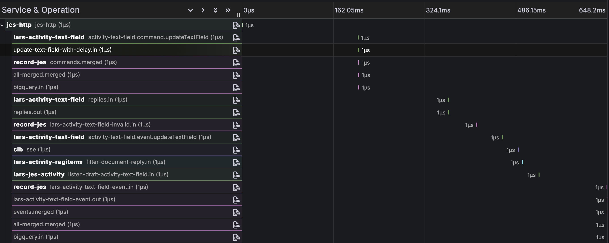

# Telemetry

The telemetry is emitted using the [OpenTelemetry](https://opentelemetry.io) standard. For logs and metrics this is done directly. For distributed traces it is indirect because event traces are flat and have no definitive end. The configuration entries `otlp.grpc` and `otlp.http` should be set to activate telemetry. The `tracesTopic` configuration entry is needed for the traces.

## Logging

The JSON Streams runtime uses the Java logger `net.pincette.json.streams`. You can set its level in the configuration entry `log`. These are the lower level loggers. Set their level to `FINEST` to see the tracing.

|Logger|Description|
|---|---|
|net.pincette.json.streams.build|Shows the JSON of the built apps, before they are started.|
|net.pincette.json.streams.config|Writes the configuration that is used to run the instance.|
|net.pincette.json.streams.keepalive|Traces the heart beat of the instances.|
|net.pincette.json.streams.leader|Traces the operations of the leader of the instances.|

Here is a configuration example:

```
log.net.pincette.json.streams = "INFO"
log.net.pincette {
  json.streams {
    keepalive = "FINEST"
    leader = "FINEST"
  }
  mongo.streams = "INFO"
}
```

There is also a Java logger for each application. Its name is simply the name of the application. You can change the log level directly under the `log` configuration entry.

You can also work with `logging.properties` file. All loggers for which you set the log level in there will get an OpenTelemetry log handler.

## Metrics

JSON Streams will add OpenTelemetry counters in the applications for all their parts, incoming and outgoing. These are observable counters that are emitted every minute. The name of the counter is always `json_streams.messages`. If your backend is Prometheus, then it will appear as `json_streams_messages_total`. The following table shows the attributes that are used. Again, if Prometheus is used, the label names are derived from the attribute names by replacing the dots with underscores, unless you do other manipulations in your telemetry collector. 

|Attribute|Description|
|---|---|
|application|It is the name of the application.|
|instance|The UUID of the JSON Streams instance.|
|part|The name of the application part that is counted, followed by the subpart in it. The suffix depends on the kind of part. For a stream the whole name will be either `<part>.in` of `<part>.out`. A merge will have `<part>.merged`. A join has the parts `<part>.left.in`, `<part>.right.in`, `<part>.left.out` and `<part>.right.out`. The latter two represent the sides at which the matches happen. Aggregates have the parts `<part>.command.<command>`, `<part>.event.<command>` and `<part>.invalid-command.<command>`.|
|profile.frame.type|This is always `json-streams`.|
|profile.frame.version|The JSON Streams version.|

The number of times an application is started and stopped is captured by the observable counters `json_streams.starts` and `json_streams.stops`. The above attributes are also applied, except `part`.

## Traces

Distributed traces are a bit special because they deviate from the typical call tree hierarchy, with a clear beginning and a clear end. Event traces are different because they are flat. The spans in them also have no duration because events only record a moment. Finally, an event trace has no clear end. It is always possible that some component reacts to something much later.

That is why all event traces are sent to a configured Kafka topic. An event trace is only generated if the message that comes through has the `_corr` field, with a UUID as its value. An event trace is a JSON message with the following fields:

|Field|Description|
|---|---|
|attributes{application}|It is the name of the application.|
|attributes{part}|The name of the application part.|
|attributes{profile.frame.type}|This is always `json-streams`.|
|attributes{profile.frame.version}|The JSON Streams version.|
|name|The name of the subpart of the application. It is the same as the suffixes in the metrics attribute `part`.|
|payload|An object with extra information. For example, invalid commands will have the original command in here.|
|serviceNamespace|This is set to the value of the `namespace` configuration entry, or `json-streams` if it is not set.|
|serviceName|The name of the application.|
|serviceVersion|The version of the application.|
|timestampNanos|The epoch nanoseconds.|
|traceId|A UUID.|
|username|This is extracted from the message field `_jwt.sub` if it is present.|

If the configuration entry `otlp.http` is set, then a small [JSON Streams application](https://github.com/json-event-sourcing/pincette-json-streams/tree/master/apps/traces) can turn a distributed trace into an OpenTelemetry trace. It consumes the configured `tracesTopic`. The first occurrence of a certain trace ID will turn that event trace into the root span. The trace ID is generated by removing the dashes from the UUID in the `traceId` field. Its span ID is the first half of the trace ID. All subsequent event traces become children of the root span. All spans will have a duration of only one microsecond. In Grafana it would look like this:



## Grafana Dashboards

If you use Grafana with Prometheus and Grafana Tempo, then there are two [dashboards](https://github.com/json-event-sourcing/pincette-json-streams/tree/master/dashboards) you can try. One is an overview dashboard that assumes you also use the [`jes-http` service](https://github.com/json-event-sourcing/pincette-jes-http). The other has a chart where you can see the number of message movements within an application.